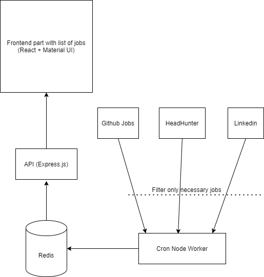

# jobs_list
# Note: this is still a work in progress (presumable time of completion: end of September 2020)
A small project which helps aggregate and filter jobs from different destinations

Now this app is using(going to use) API from:
* Github Jobs (https://jobs.github.com/api)
* HeadHunter (https://dev.hh.ru/)
* LinkedIn (https://www.linkedin.com/developers/)

- Frontend: JS + React + Material UI
- Express REST API
- Redis for caching
- The API part is an Express server which uses node workers to update our jobs on cron

